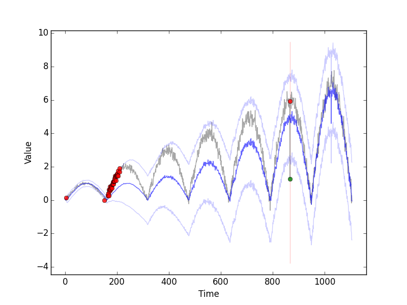

# anomaly
A simple Python framework to compare time series anomaly detection algorithms.
The framework allows to exchange different function of the detection algorithm:
- The forecast function (e.g. moving average)
- The error function (e.g. absolute error or the RMSE)
- The threshold function (e.g. simple threshold or standard deviation)

Some of the implemented algorithms are:
- moving average
- naive
- seasonal naive
- single/double/triple exponential smoothing
- an own ensemble of seasonal naive and exponential smoothing (seasonal exponential smoothing)

To easily evaluate the algorithm, the package comes with a function to simply create own test data with injected
anomalies (datagen.py).

# Example Plots
The example folder shows how to use the framework and how to plot the results.
The following three plots were created based on the seasonal triple exponential smoothing algorithm

# TODO
- clean up
- switch to Python 3
- do proper packaging
